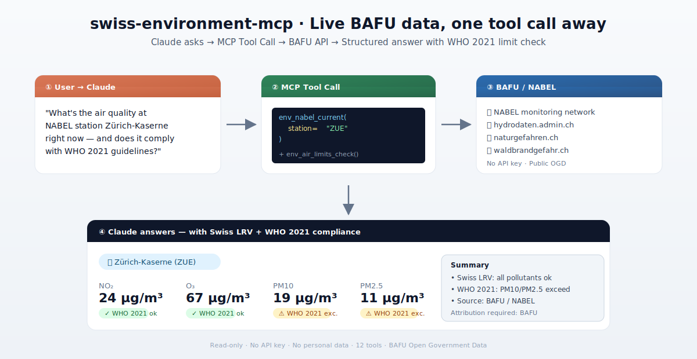

[🇬🇧 English Version](README.md)

> 🇨🇭 **Teil des [Swiss Public Data MCP Portfolios](https://github.com/malkreide)**

# 🌿 swiss-environment-mcp


[](https://opensource.org/licenses/MIT)
[](https://www.python.org/downloads/)
[](https://modelcontextprotocol.io/)
[](https://github.com/malkreide/swiss-environment-mcp/actions)
[](https://opendata.swiss/de/organization/bafu)

> MCP-Server, der KI-Modelle mit Schweizer Umweltdaten des BAFU verbindet – Luftqualität, Hydrologie, Naturgefahren, Waldbrandgefahr und offene Umweltdatensätze.

<p align="center">
  
</p>

---

## Übersicht

**swiss-environment-mcp** gibt KI-Assistenten wie Claude direkten Zugriff auf Echtzeit-Umweltdaten der Schweizer Bundesbehörden – ohne API-Keys. Luftqualitätsmessungen des nationalen NABEL-Messnetzes, hydrologische Messstationen, Naturgefahren-Bulletins und der vollständige BAFU-Datenkatalog sind über eine einzige standardisierte MCP-Schnittstelle zugänglich.

Der Server deckt vier thematische Cluster ab: Luftqualität (NABEL), Hydrologie, Naturgefahren und den BAFU-Open-Data-Katalog. Jeder Cluster entspricht einer Gruppe zweckgerichteter Tools, die Rohdaten der Bundesbehörden in saubere JSON-Antworten übersetzen.

**Anker-Demo-Abfrage:** *«Wie ist die aktuelle Luftqualität an der NABEL-Station Zürich-Kaserne – und hält sie die WHO-2021-Richtwerte ein?»*

---

## Funktionen

- 🌬️ **Luftqualitäts-Monitoring** – 16 NABEL-Stationen, NO₂/O₃/PM10/PM2.5/SO₂/CO, Schweizer LRV- und WHO-2021-Grenzwertprüfung
- 💧 **Hydrologie** – Pegel, Abfluss, Temperaturen an Schweizer Messstationen
- 🚨 **Hochwasserwarnungen** – aktive Warnungen nach Gefahrenstufe und Kanton
- 🏔️ **Naturgefahren-Bulletin** – SLF/BAFU-Bulletin auf DE/FR/IT/EN, regionsspezifische Warnungen
- 🔥 **Waldbrandgefahr** – Kantons- und Regionalindex für Waldbrandgefahr
- 📦 **BAFU-Open-Data-Katalog** – Umweltdatensätze suchen und abrufen via CKAN
- 🔑 **Keine Authentifizierung erforderlich** – alle Datenquellen sind öffentlich zugänglich
- ☁️ **Dual Transport** – stdio für Claude Desktop, Streamable HTTP/SSE für Cloud-Deployment

---

## Voraussetzungen

- Python 3.11+
- Keine API-Keys erforderlich – alle Endpunkte sind ohne Authentifizierung öffentlich zugänglich

---

## Installation

```bash
# Repository klonen
git clone https://github.com/malkreide/swiss-environment-mcp.git
cd swiss-environment-mcp

# Installieren
pip install -e .
```

Oder mit `uvx` (ohne dauerhafte Installation):

```bash
uvx swiss-environment-mcp
```

Oder via pip:

```bash
pip install swiss-environment-mcp
```

---

## Schnellstart

```bash
# Server starten (stdio-Modus für Claude Desktop)
swiss-environment-mcp
```

Sofort in Claude Desktop ausprobieren:

> *«Wie ist die aktuelle Luftqualität an der NABEL-Station Zürich-Kaserne?»*
> *«Gibt es aktuell aktive Hochwasserwarnungen in der Schweiz?»*
> *«Wie hoch ist die Waldbrandgefahr im Kanton Wallis?»*

---

## Konfiguration

### Claude Desktop

**Minimal (empfohlen):**

```json
{
  "mcpServers": {
    "swiss-environment": {
      "command": "uvx",
      "args": ["swiss-environment-mcp"],
      "env": {}
    }
  }
}
```

**Pfad zur Konfigurationsdatei:**
- macOS: `~/Library/Application Support/Claude/claude_desktop_config.json`
- Windows: `%APPDATA%\Claude\claude_desktop_config.json`

Nach dem Speichern Claude Desktop vollständig neu starten.

### Cloud-Deployment (SSE für Browser-Zugriff)

Für den Einsatz via **claude.ai im Browser** (z. B. auf verwalteten Arbeitsplätzen ohne lokale Software-Installation):

**Render.com (empfohlen):**
1. Repository auf GitHub pushen/forken
2. Auf [render.com](https://render.com): New Web Service → GitHub-Repo verbinden
3. Render erkennt `render.yaml` automatisch
4. In claude.ai unter Settings → MCP Servers eintragen: `https://your-app.onrender.com/sse`

**Docker:**
```bash
docker build -t swiss-environment-mcp .
docker run -p 8000:8000 swiss-environment-mcp
```

> 💡 *«stdio für den Entwickler-Laptop, SSE für den Browser.»*

---

## Verfügbare Tools

### 🌬️ Luftqualität / NABEL (3 Tools)

| Tool | Beschreibung | Datenquelle |
|---|---|---|
| `env_nabel_stations` | Alle 16 NABEL-Messstationen mit Standorttyp und Kanton auflisten | NABEL / BAFU |
| `env_nabel_current` | Aktuelle Luftqualitätsdaten einer Station (NO₂, O₃, PM10, PM2.5, SO₂, CO) | NABEL / BAFU |
| `env_air_limits_check` | Messwert gegen Schweizer LRV-Grenzwerte und WHO-2021-Richtwerte prüfen | Integriert |

### 💧 Hydrologie (4 Tools)

| Tool | Beschreibung | Datenquelle |
|---|---|---|
| `env_hydro_stations` | Hydrologische Messstationen nach Kanton oder Gewässer filtern | hydrodaten.admin.ch |
| `env_hydro_current` | Aktueller Pegel, Abfluss und Wassertemperatur einer Station | hydrodaten.admin.ch |
| `env_hydro_history` | Historische Stundenwerte (bis 30 Tage) mit Download-Links ⚠️ | hydrodaten.admin.ch |
| `env_flood_warnings` | Aktive Hochwasserwarnungen nach Gefahrenstufe und Kanton | hydrodaten.admin.ch |

### 🏔️ Naturgefahren (3 Tools)

| Tool | Beschreibung | Datenquelle |
|---|---|---|
| `env_hazard_overview` | Aktuelles Naturgefahren-Bulletin (SLF/BAFU) auf DE/FR/IT/EN | naturgefahren.ch |
| `env_hazard_regions` | Regionsspezifische Warnungen (Hochwasser, Lawinen, Steinschlag) | naturgefahren.ch |
| `env_wildfire_danger` | Waldbrandgefahren-Index nach Kantonen und Regionen | waldbrandgefahr.ch |

### 📊 Umweltdatenkatalog (2 Tools)

| Tool | Beschreibung | Datenquelle |
|---|---|---|
| `env_bafu_datasets` | BAFU-Datensätze auf opendata.swiss suchen (CKAN-API) | opendata.swiss |
| `env_bafu_dataset_detail` | Vollständige Metadaten und Download-URLs eines Datensatzes | opendata.swiss |

### Beispiel-Abfragen

| Abfrage | Tool |
|---|---|
| *«Luftqualität an Zürich-Kaserne gerade?»* | `env_nabel_current` |
| *«Überschreitet 45 µg/m³ NO₂ den Schweizer Grenzwert?»* | `env_air_limits_check` |
| *«Aktueller Wasserstand der Limmat in Zürich?»* | `env_hydro_current` |
| *«Aktive Hochwasserwarnungen in der Schweiz?»* | `env_flood_warnings` |
| *«Naturgefahren-Bulletin für Graubünden?»* | `env_hazard_overview` |
| *«Waldbrandgefahr im Kanton Wallis?»* | `env_wildfire_danger` |
| *«BAFU-Biodiversitätsdatensätze auf opendata.swiss?»* | `env_bafu_datasets` |

---

## 🛡️ Safety & Limits

| Aspekt | Details |
|--------|---------|
| **Zugriff** | Nur lesend (`readOnlyHint: true`) — der Server kann keine Daten ändern oder löschen |
| **Personendaten** | Keine personenbezogenen Daten — alle Quellen sind aggregierte, öffentliche Umweltmessdaten |
| **Rate Limits** | Eingebaute Obergrenzen pro Abfrage (z.B. max. 30 Tage Hydrologie-Historie, 50 Datensatz-Suchergebnisse) |
| **Timeout** | 30 Sekunden pro API-Aufruf |
| **Authentifizierung** | Keine API-Keys nötig — alle BAFU-Endpunkte sind öffentlich zugänglich |
| **Lizenzen** | BAFU Open Government Data (OGD) — freie Nutzung mit obligatorischer Quellenangabe |
| **Nutzungsbedingungen** | Es gelten die ToS der jeweiligen Datenquellen: [BAFU / opendata.swiss](https://opendata.swiss/de/organization/bafu), [hydrodaten.admin.ch](https://hydrodaten.admin.ch), [naturgefahren.ch](https://naturgefahren.ch), [waldbrandgefahr.ch](https://waldbrandgefahr.ch) |

---

## Architektur

```
┌─────────────────┐     ┌───────────────────────────┐     ┌──────────────────────────┐
│   Claude / KI   │────▶│   Swiss Environment MCP   │────▶│  BAFU / Bundesbehörden   │
│   (MCP Host)    │◀────│   (MCP Server)            │◀────│                          │
└─────────────────┘     │                           │     │  hydrodaten.admin.ch     │
                        │  12 Tools · 3 Resources   │     │  naturgefahren.ch        │
                        │  Stdio | SSE              │     │  waldbrandgefahr.ch      │
                        │                           │     │  opendata.swiss (CKAN)   │
                        │  api_client.py            │     └──────────────────────────┘
                        │  server.py (FastMCP)      │
                        └───────────────────────────┘
```

### Datenquellen

| Quelle | Daten | Lizenz |
|---|---|---|
| [hydrodaten.admin.ch](https://hydrodaten.admin.ch) | Pegel, Abfluss, Temperaturen (10-Min-Intervall) | BAFU OGD |
| [naturgefahren.ch](https://naturgefahren.ch) | Naturgefahren-Bulletin (SLF/BAFU) | BAFU/SLF |
| [waldbrandgefahr.ch](https://waldbrandgefahr.ch) | Waldbrandgefahren-Index | BAFU |
| [opendata.swiss](https://opendata.swiss/de/organization/bafu) | BAFU-Datenkatalog (CKAN-API) | OGD |

Alle Daten: öffentlich zugänglich, keine Authentifizierung erforderlich.  
**Quellenangabe erforderlich:** Bei Verwendung der BAFU-Daten muss das BAFU als Quelle angegeben werden.

---

## Projektstruktur

```
swiss-environment-mcp/
├── src/swiss_environment_mcp/
│   ├── __init__.py          # Paket
│   ├── server.py            # FastMCP-Server: 12 Tools, 3 Resources
│   └── api_client.py        # HTTP-Client für 4 BAFU-Datenquellen
├── tests/
│   └── test_integration.py  # Integrationstests
├── .github/
│   └── workflows/
│       └── ci.yml           # GitHub Actions CI (Python 3.11–3.13)
├── Dockerfile               # Container für Cloud-Deployment
├── Procfile                 # Prozessdefinition
├── render.yaml              # Render.com One-Click-Deployment
├── pyproject.toml           # Build-Konfiguration (hatchling)
├── CHANGELOG.md
├── CONTRIBUTING.md
├── LICENSE
├── README.md                # Englische Hauptversion
└── README.de.md             # Diese Datei (Deutsch)
```

---

## Bekannte Einschränkungen

- **`env_hydro_history`**: Der historische Stundenwert-Endpunkt liefert aktuell 404-Fehler von hydrodaten.admin.ch (BUG-01 – in Abklärung). Das Tool gibt Download-Links als Fallback zurück.
- **NABEL**: Nur Nahzeit-Daten; keine historischen Zeitreihen über diesen Server.
- **Naturgefahren**: Bulletins hängen vom Publikationsrhythmus von SLF/BAFU ab.
- **Waldbrandgefahr**: Regionale Granularität variiert je nach Saison und Datenverfügbarkeit.

---

## Tests

```bash
# Unit-Tests (kein Netzwerk erforderlich)
PYTHONPATH=src pytest tests/ -m "not live"

# Integrationstests (erfordern live BAFU-APIs)
PYTHONPATH=src pytest tests/ -m "live"

# Linting
ruff check src/
```

---

## Beitragen

Siehe [CONTRIBUTING.md](CONTRIBUTING.md) (Englisch) · [CONTRIBUTING.de.md](CONTRIBUTING.de.md) (Deutsch)

---

## Changelog

Siehe [CHANGELOG.md](CHANGELOG.md)

---

## Lizenz

MIT-Lizenz – siehe [LICENSE](LICENSE)

Die Quelldaten unterliegen den BAFU-Nutzungsbedingungen. Die Quellenangabe des BAFU ist bei der Verwendung ihrer Daten Pflicht.

---

## Autor

Hayal Oezkan · [github.com/malkreide](https://github.com/malkreide)

---

## Credits & Verwandte Projekte

- **Daten:** [BAFU / Bundesamt für Umwelt](https://www.bafu.admin.ch) · [hydrodaten.admin.ch](https://hydrodaten.admin.ch) · [naturgefahren.ch](https://naturgefahren.ch) · [opendata.swiss](https://opendata.swiss/de/organization/bafu)
- **Protokoll:** [Model Context Protocol](https://modelcontextprotocol.io/) – Anthropic / Linux Foundation
- **Verwandt:**

| Server | Beschreibung |
|---|---|
| [zurich-opendata-mcp](https://github.com/malkreide/zurich-opendata-mcp) | Stadt Zürich Open Data (OSTLUFT Luftqualität, Wetter, Parking, Geodaten) |
| [swiss-transport-mcp](https://github.com/malkreide/swiss-transport-mcp) | OJP 2.0 Reiseplanung, SIRI-SX Störungen |
| [swiss-road-mobility-mcp](https://github.com/malkreide/swiss-road-mobility-mcp) | GBFS Shared Mobility, EV-Ladestationen, DATEX II Verkehr |
| [swiss-statistics-mcp](https://github.com/malkreide/swiss-statistics-mcp) | BFS STAT-TAB – 682 Statistik-Datensätze |

**Synergiebeispiel:** *«Wie war die Luftqualität beim Schulhaus Leutschenbach heute – und liegt sie über dem nationalen NABEL-Durchschnitt?»*  
→ `zurich-opendata-mcp` (OSTLUFT, lokal) + `swiss-environment-mcp` (NABEL, national)

- **Portfolio:** [Swiss Public Data MCP Portfolio](https://github.com/malkreide)
